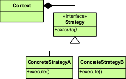

## Concept
This is a way of creating different kinds of characters for an RPG style game who all inherit from the same 'Adventurer' class
 
Each adventurer has an attack and a catchphrase
`IAttackBehaviour` and `ICatchphraseBehaviour` are interfaces which have different types of attack and catchphrase under them which are assigned to each kind of adventurer
Each Wizard (Adventurer) is instantiated with a `SayWizardCatchphrase` behavour and a `MagicAttack` for their attack
This is called `delegating` behaviours

Putting classes together to give the Adventurers their behaviours is called `composition` and is an alternative to inheritance

You may need to change the behaviour of an adventurer on the fly
To do this There are methods on the Adventurer superclass to switch out the behaviours. see `setCatchphraseBehaviour` and `setAttackBehaviour`

```
The Strategy Pattern defines a family of algorithms, encapsulates each one, and makes them interchangeable.
Strategy lets the algorithm vary independently from clients that use it.
```

The strategies are the behaviour types
The context is the Adventurer

## issues
The attacks should run asynchronously in threads but are currently blocking the main thread

## When to use
## When not to use