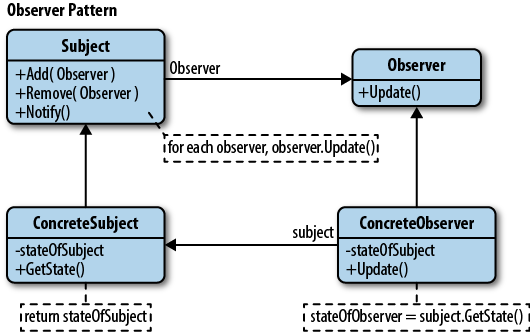

## Info

Note: This is different to the Publish-Subscribe pattern

In the observer pattern there are 2 main types of entity. The `subject` and the `observer`. I've called the observer the same name to avoid confusion but it is not techinically an observer unless it is currently observing the subject.

The subject will have some information stored in state.
When this changes Observers who are currently observing (subscribed to) the subject will be sent the new information
Observers of the same type who are not observing won't got sent anything

Observers should be able to be added or removed as observers.

```
The Observer Pattern defines a one-to-many dependency between objects so that when one object changes state,
 all of its dependents are notified and updated automatically.
```


## Why?
The observer and subject are loosely coupled meaning
- subject only knows about the IObserverPush, not which concrete observer it's using
- Observers can be added or removed at any time without editing the subject
- Subject and Objects can be re-used and modified independently of each other
