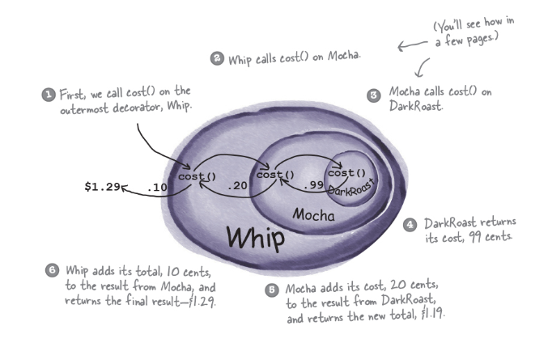
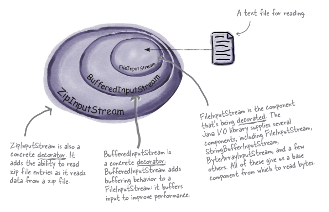

## info

In this example we're building a coffee ordering system.

Because there are multiple things that vary in a coffee such as roast, milk type, and syrups if we don't encapsulate them seperatley and rely on composition we'll get a class nightmare!

In example one we have a system where we can choose one option for each aspect of the copy and `compose` a coffee cup
```
cofffe + (dairy/almond) + (none,vanilla)
```

If we couldn't pick seperatley we would need all these classes:
```
NoMilkNoSyrup
NoMilkVanillaSyrup
DairyMilkNoSyrup
DairyMilkVanillaSyrup
AlmondMilkNoSyrup
AlmondMilkVanillaSyrup
```




## Generic
Decorators have the same supertype as the objects they decorate
You wrap decorators around them as many times as you want.
You can wrap at runtime

```
The Decorator Pattern attaches additional responsibilities to an object dynamically. Decorators provide a flexible alternative to subclassing for extending functionality.
```

Some other pattern which use decorated objects include `FACTORY`and `BUILDER`

## When not to use
Wrapping a class in decorators can 'hide' its base class so will cause problems if you have something which relies on knowing the concrete implementation to work like tests