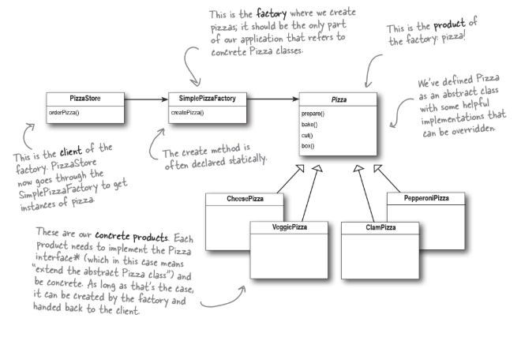
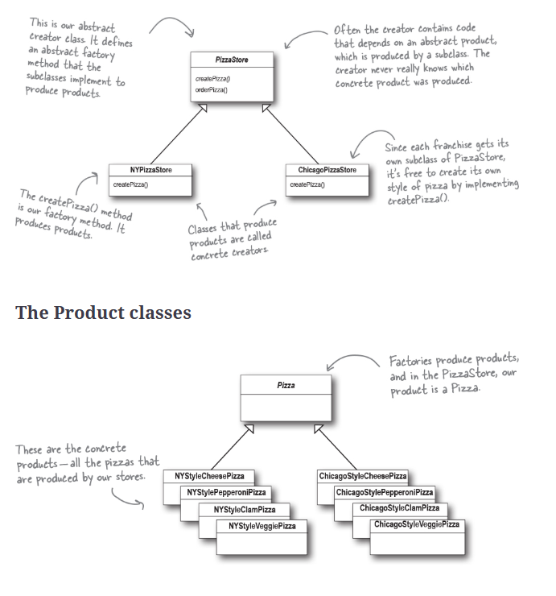

## Info
Product classes are what is being created by the factory. In this example the pizzas
Creator classes are the ones that create the products. In this case our Pizza Stores.


This may not be appropriate if you need many different Creator types or you could encapsulate what changes further. For instance the ingredients could be added to the pizzas by composition with just one class for each product type (Chicago, Basic)

```
The Factory Method Pattern defines an interface for creating an object, but lets subclasses decide which class to instantiate. Factory Method lets a class defer instantiation to subclasses.
```




## Options
You can make the factory a static method. You don't need to instantiate an object to use the create method but you can't change the behaviour of the create method by using subclasses
